<div align="center">

<picture>
  <source media="(prefers-color-scheme: dark)" srcset="assets/header-dark.svg">
  <source media="(prefers-color-scheme: light)" srcset="assets/header-light.svg">
  
</picture>

</div>

<br>

```ts
const me = {
  role: "Full-Stack Developer",
  currentlyBuilding: "HelpDeks — a marketplace",
  frontend: ["React", "TypeScript"],
  backend: ["Java", "Spring Boot"],
  mood: "purring when the build is green 🐈",
  bugsFixed: "all of them (allegedly)",
};
```

### 🔭 Currently

Building **HelpDeks**, a marketplace with a **React + TypeScript** frontend and a **Java Spring Boot** backend.
Naps are scheduled between deployments. 🐾

### 🧰 Stack

<div align="center">

<picture>
  <source media="(prefers-color-scheme: dark)" srcset="assets/stack-dark.svg">
  <source media="(prefers-color-scheme: light)" srcset="assets/stack-light.svg">
  
</picture>

</div>

### 🐍 The snake is hungry

<div align="center">

<picture>
  <source media="(prefers-color-scheme: dark)" srcset="https://raw.githubusercontent.com/DeepanshuSharma05/DeepanshuSharma05/output/github-snake-dark.svg">
  <source media="(prefers-color-scheme: light)" srcset="https://raw.githubusercontent.com/DeepanshuSharma05/DeepanshuSharma05/output/github-snake.svg">
  
</picture>

<sub>the cat is watching. the snake knows. 🐈👀</sub>

</div>
